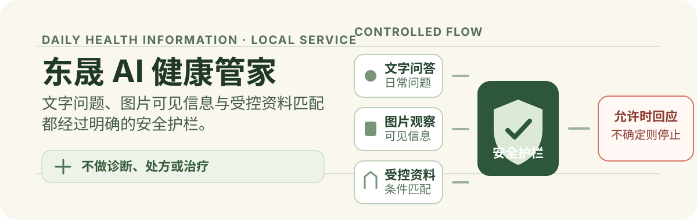

# 东晟 AI 健康管家

<p align="center">
  
</p>

## 价值

这是一个本地运行的日常健康与体重管理信息服务。它接收文字问题，或观察上传图片中**清晰可见**的信息，再在资料和风险条件允许时给出日常管理方向与受控产品资料。

它不做疾病诊断、处方或治疗，不应替代医生、药师或紧急医疗服务。

## 代码与测试证据

当前仓库的 [`test_hqbot_api.py`](test_hqbot_api.py) 是可直接执行的断言检查，覆盖的范围包括：

- JPEG、PNG、WebP 的图片输入校验，以及舌照、报告、截图/海报等来源区分。
- 对图像不清、没有稳定可见细节或不匹配时，不展示候选产品的分支。
- 对孕哺、儿童、过敏、慢病、用药和紧急症状等风险信息的安全回复与本地兜底。
- 图像上下文的一次性使用、用户绑定、过期和并发占用处理；以及文字会话的短期进程内记忆。
- 上游文字模型或 Dify 超时、错误时，回复本地安全兜底而非上游错误内容。

运行检查：

```sh
cd dongsheng-ai-health-manager
OPENAI_API_KEY=test \
OPENAI_BASE=https://example.com/openai/v1 \
python3 test_hqbot_api.py
```

这项检查以本地桩替代外部模型调用；它验证代码分支，不证明任何生产环境、模型供应商或线上服务已经可用。

## 接口与受控机制

服务默认只监听 `127.0.0.1:8093`，提供三个 JSON 接口：

- `GET /health`：本地健康检查。
- `POST /api/chat`：接收 `query`，可附带 `user`、`conversation_id` 或一次性 `context_id`。
- `POST /api/tongue`：接收 base64 的 JPEG、PNG 或 WebP 图片，可附带 `user`；返回图片类别、可见信息及（仅在条件满足时）受控资料。

### 最小请求与响应

以下健康检查由当前代码实现确认，不访问上游模型：

```sh
curl -s http://127.0.0.1:8093/health
```

```json
{"ok": true}
```

`/api/chat` 的成功响应在 `ok` 之外带有 `answer`、`conversation_id`、`fast_path` 和 `mode`。带图上下文的请求只能被同一 `user` 领取一次；占用中返回 `409 context_in_use`，失效或不匹配返回 `410 context_unavailable`。

### 护栏如何介入

1. 图片路径只转写或描述画面中可稳定辨认的内容；截图、海报和不清晰图片不当作直接舌照。
2. 文字和图片结果都附带医疗边界；急症提示立即拨打 `120`，而不是继续给建议。
3. 产品资料来自代码内的受控目录。出现过敏、孕哺、儿童、慢病、用药或信息不足时，代码要求核对包装并咨询医生或药师，或不展示候选产品。
4. 模型请求异常时，服务切换到本地安全回复；短会话与图像上下文仅保留在进程内，不是账户级健康档案。

## 最小运行

需要一个 OpenAI 兼容的文字/视觉接口。密钥只通过环境变量提供，不能提交到仓库：

```sh
export OPENAI_API_KEY="..."
export OPENAI_BASE="https://example.com/v1"
python3 hqbot_api.py
```

启动后可先运行上面的 `/health` 请求。图片接口的 `image` 字段是原始文件内容的 base64 字符串；单个输入由代码限制为 12 MB 以内，仅接受 JPEG、PNG 或 WebP。

## 安全与限制

- 仅用于日常健康与营养信息参考；不诊断疾病，不开处方，不承诺治疗效果，也不建议自行开始、停用或调整药物、保健品或中成药。
- 舌照只描述图中可见特征，不能确认疾病、症状、体质、性别、生理周期、年龄或其他图外信息；体测报告只转写清晰可见的原文指标。
- 产品成分和支持方向来自企业资料。实际配料、过敏原、食用要求及是否适合，以产品包装标签和专业人员意见为准。
- 仓库不包含生产密钥、密码、真实用户健康数据、价格、库存或订单信息。
- 尚未验证生产部署、持续运行、真实模型输出或线上数据处理流程；请勿把本仓库视为已经投入临床或生产使用的服务。

## 许可

当前**未授予开源许可**。代码公开用于项目协作与版本追踪；其他使用需取得项目所有者授权。
